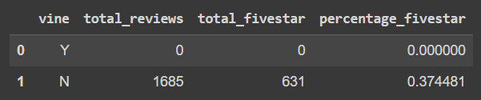

# Amazon_Vine_Analysis

## Overview 

Analysis of Amazon reviews written by members of the paid Amazon Vine program. The Amazon Vine program is a service that allows manufacturers and publishers to receive reviews for their products. Companies like SellBy pay a small fee to Amazon and provide products to Amazon Vine members, who are then required to publish a review.

The analysis focuses on reviews from the "Digital Video Game v1_00" dataset.

## Results
The dataset for analysis had no vine reviews. The analysis was manually verified and double checked to confirm this result. Further details in the summary section of the analysis.

The questions below reference the following results from the dataframe:

### How many Vine reviews and non-Vine reviews were there?

Total Vine Reviews:
    * Vine had 0 reviews. 
    * Non-Vine had 1685 reviews.

### How many Vine reviews were 5 stars? How many non-Vine reviews were 5 stars?

Five-Star Reviews:
    * Vine had 0 five star ratings.
    * Non-Vine had 631 five star ratings.

### What percentage of Vine reviews were 5 stars? What percentage of non-Vine reviews were 5 stars?

Percentage of Five-Star reviews by Vine / Non-Vine:
    * Vine had 0% five star ratings.
    * Non-Vine had ~37% five star ratings. 

## Summary

The analysis could not confirm nor deny any bias due to lack of data in this category.

It is unknown why there were 0 vine reviews, but I suspect the vine program may have been discontinued for this category. More research into the vine program and further analysis into other categories are needed.